# Ridho Fauzian Pratama
# 2241720142
# TI - 3H / 21

## Praktikum : 1 Membuat Project Flutter Baru
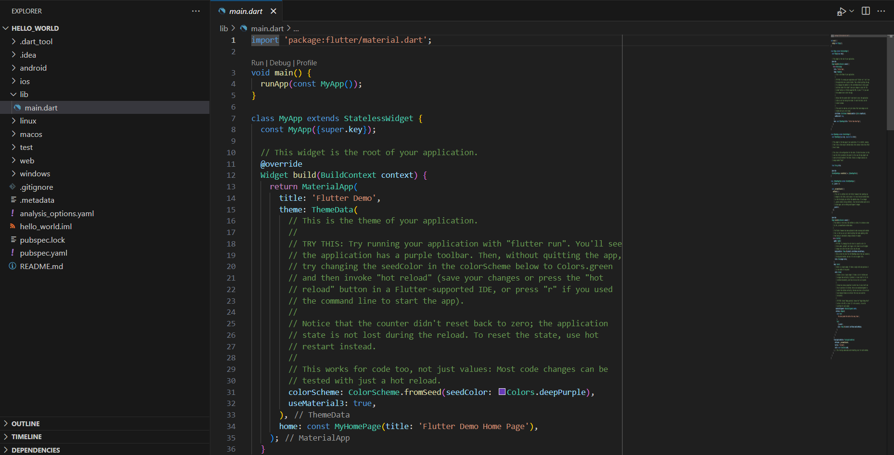

## Praktikum : 2 Menghubungkan Perangkat Android atau Emulator
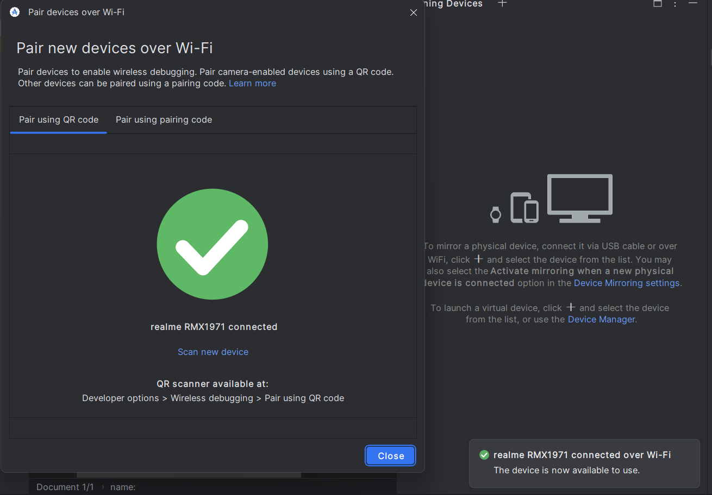

## Praktikum : 3 Membuat Repository GitHub dan Laporan Praktikum 
### Langkah 10
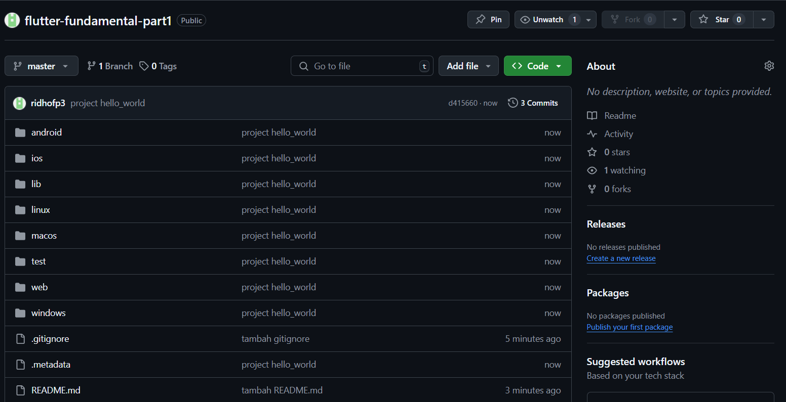 
### Langkah 11
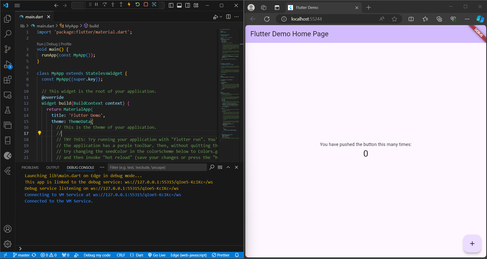 
### Langkah 12
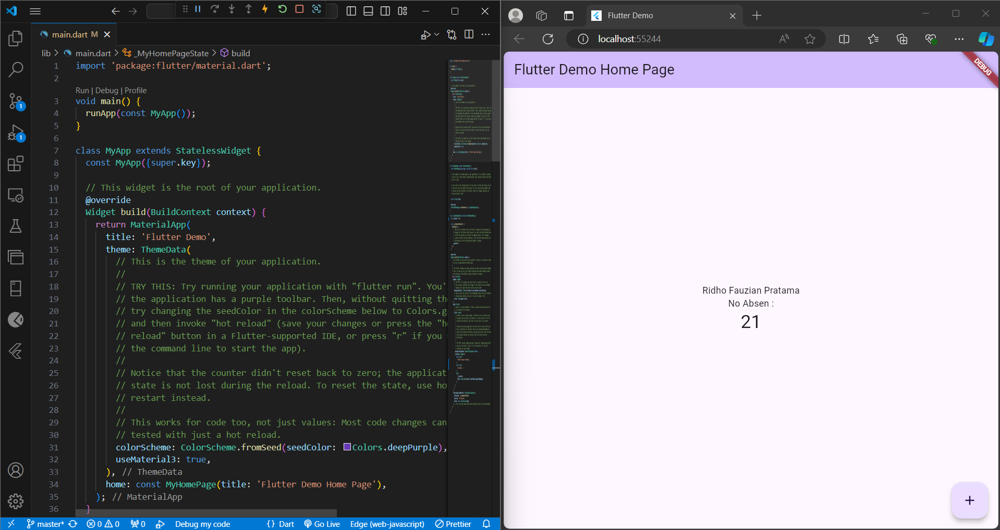

## Praktikum : 4 Menerapkan Widget Dasar
### Langkah 1
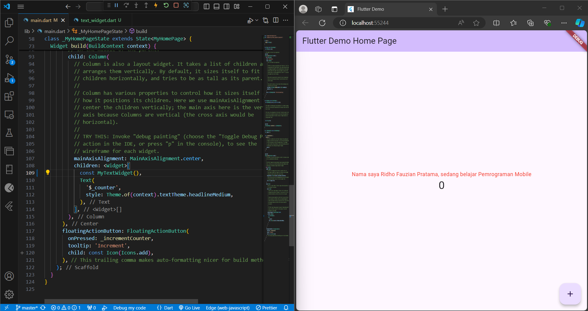
### Langkah 2
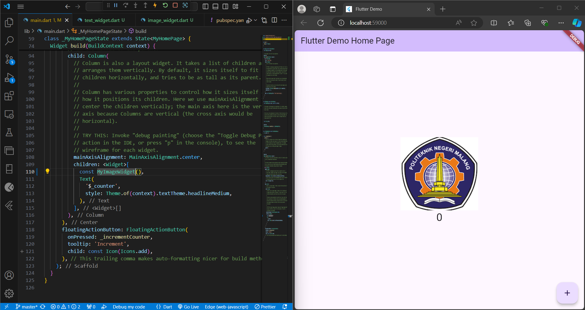 

## Praktikum : 5
### Langkah 3 : Scaffold Widget
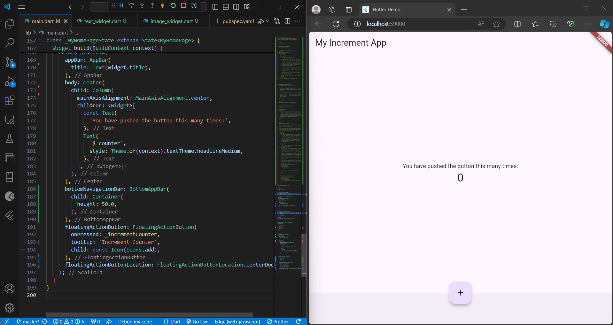
### Langkah 4 : Dialog Widget
Tampilan Awal :

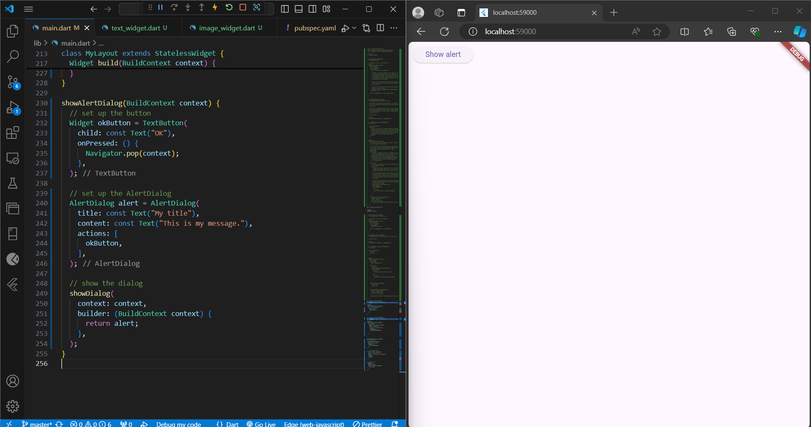

Tampilan Awal :

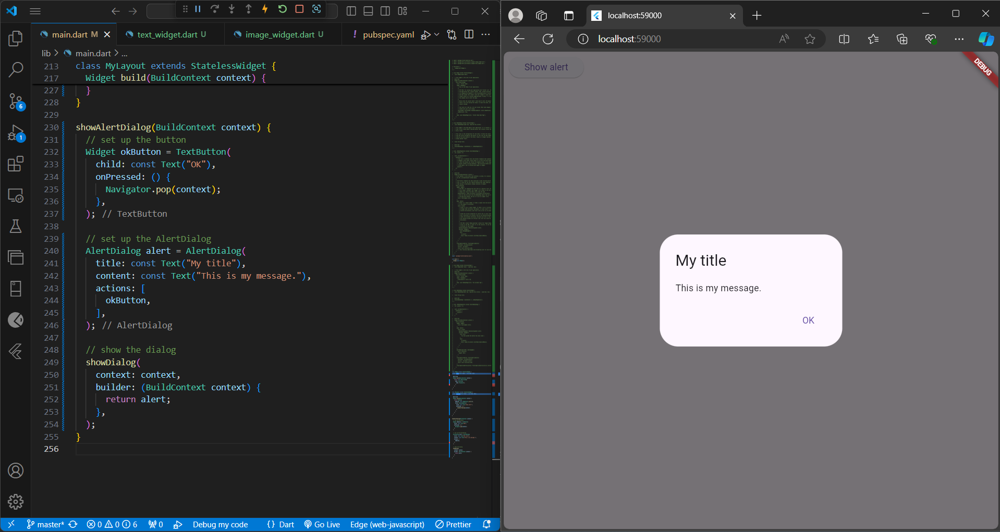 

Jika diklik ok maka alertnya akan hilang
### Langkah 5 : Input dan Selection Widget
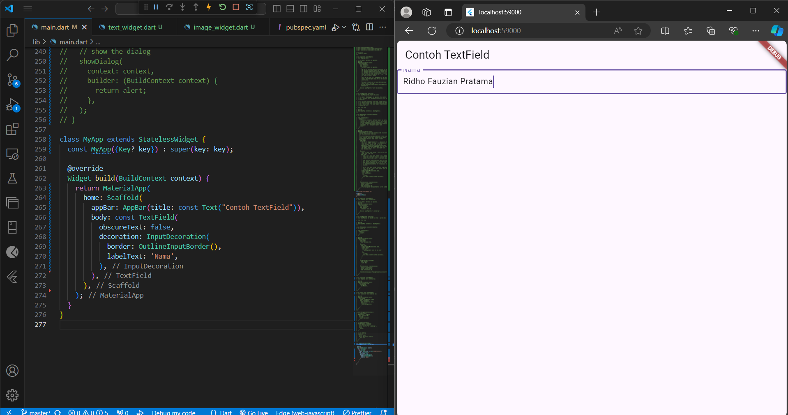
### Langkah 6 : Date and Time Pickers 
Tampilan Awal :

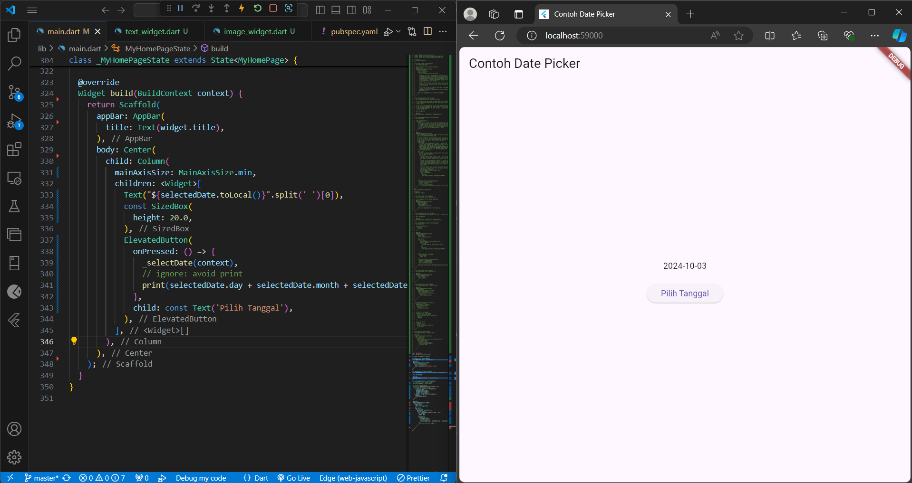

Jika diklik pilih Tanggal :

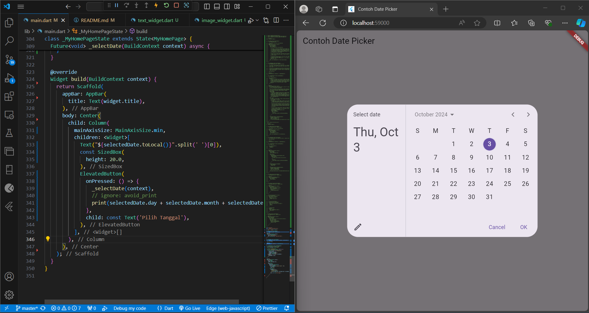 